# SeqWM: Empowering Multi-Robot Cooperation via Sequential World Models

The official implementation of the paper [Empowering Multi-Robot Cooperation via Sequential World Models](https://arxiv.org).

---
## Overview

To address the difficulty of applying model-based reinforcement learning (MBRL) to multi-robot systems, we propose the **Sequential World Model (SeqWM)**. This framework decomposes complex joint dynamics by using independent, sequentially-structured models for each agent. Planning and decision-making occur via sequential communication, where each agent bases its actions on the predictions of its predecessors. This design enables explicit intention sharing, boosts cooperative performance, and reduces communication complexity. Results show SeqWM outperforms state-of-the-art methods in simulations and real-world deployments, achieving advanced behaviors like predictive adaptation and role division. 

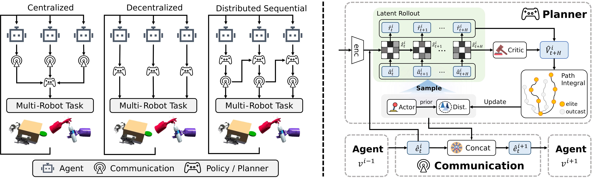

---
## ⚙️ Installation
```bash
conda create -n seqwm python=3.8 -y
conda activate seqwm
pip install -r requirements.txt
```
If you encounter issues when installing **Isaac Gym**, **Bi-DexHands** or **MQE**  please refer to [Isaac Gym](https://developer.nvidia.com/isaac-gym), [Bi-DexHands](https://github.com/PKU-MARL/DexterousHands) and [MQE](https://github.com/ziyanx02/multiagent-quadruped-environment).

## 🚀 Quick Start
For training, please run:
```bash
python examples/train.py --load_config configs/dexhands/ShadowHandBottleCap/seqwm/config.json
```
You can modify the configuration in `configs/{env_name}/{task_name}/seqwm/config.json` to customize the training process.


## 📈 Curves
SeqWM consistently outperforms state-of-the-art baselines in both Bi-DexHands and Multi-Quad environments.

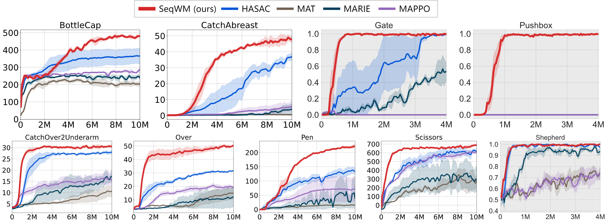

## 🎥 Demos

### 👐 Bi-DexHands
These GIFs showcase SeqWM’s ability to solve complex bimanual manipulation tasks.
<p align="center">
  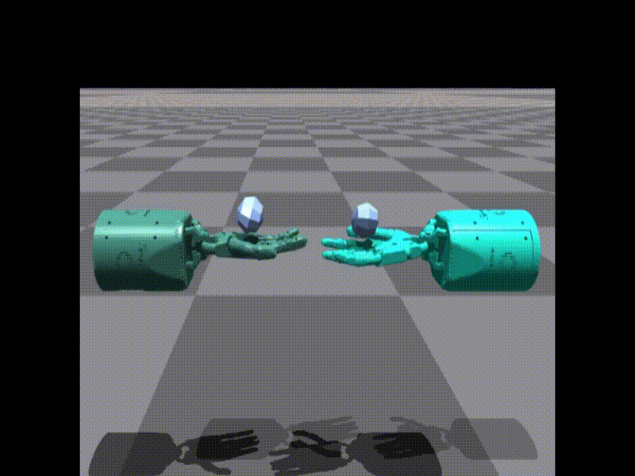
  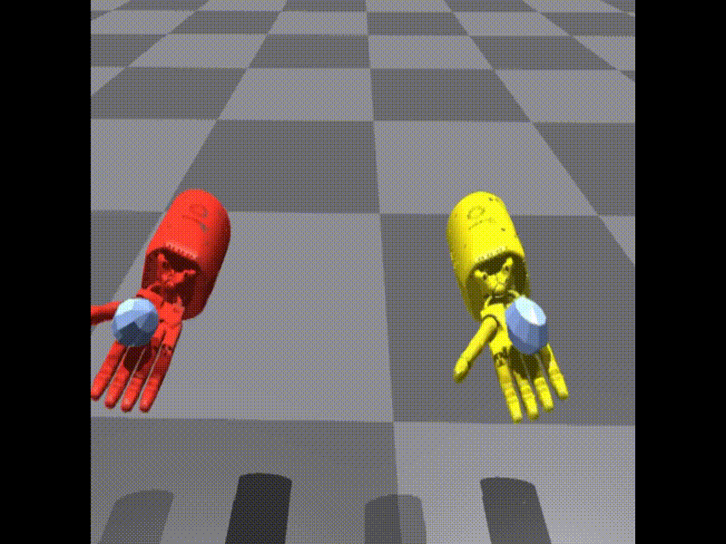
  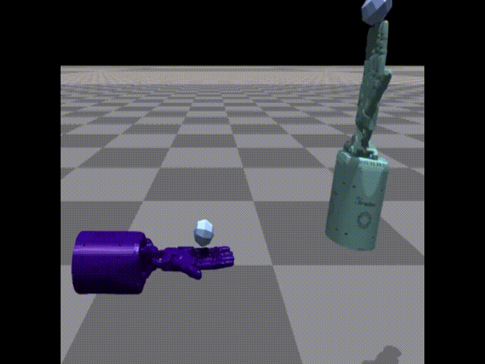
  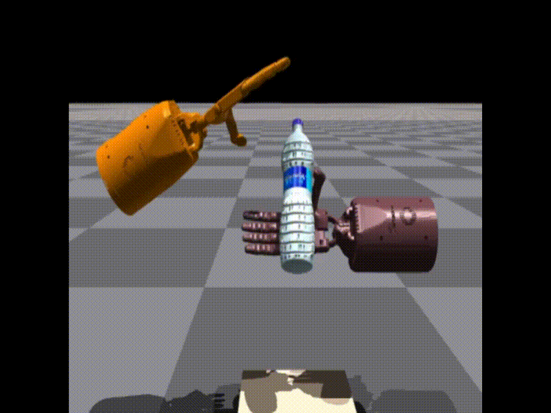
    
    
</p>

### 🤖 Multi-Quadruped
In the Multi-Quad environment, SeqWM supports scalable cooperation among 2–5 quadruped robots.
<p align="center">
    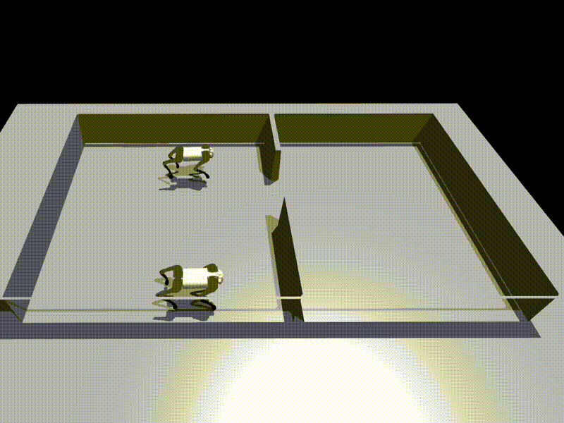
    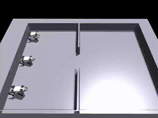
    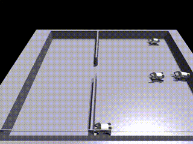
    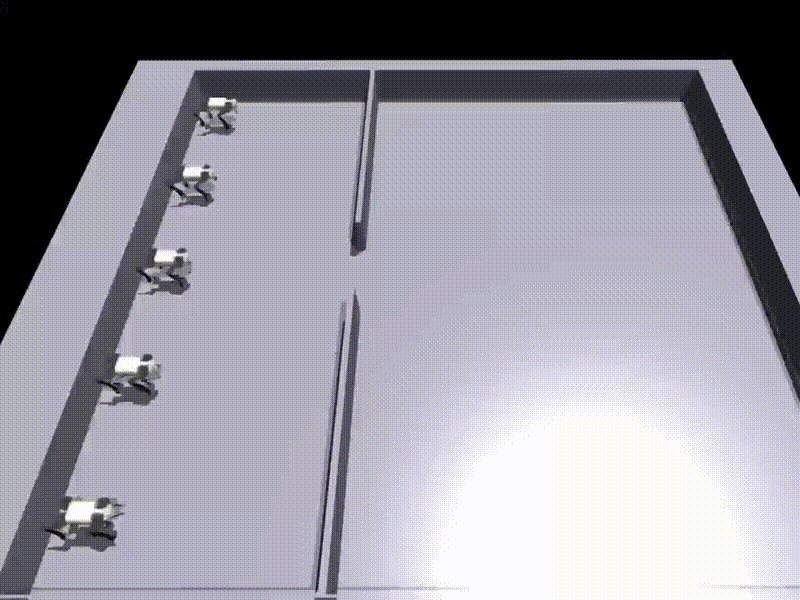
    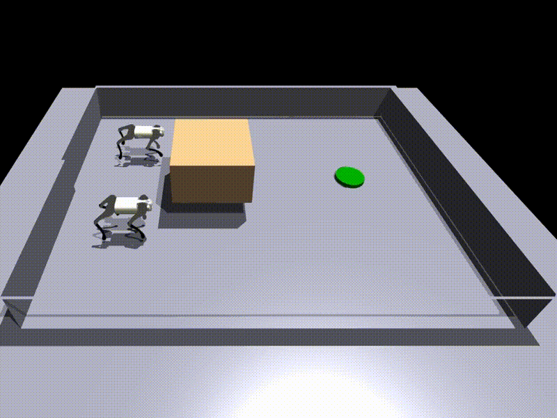
    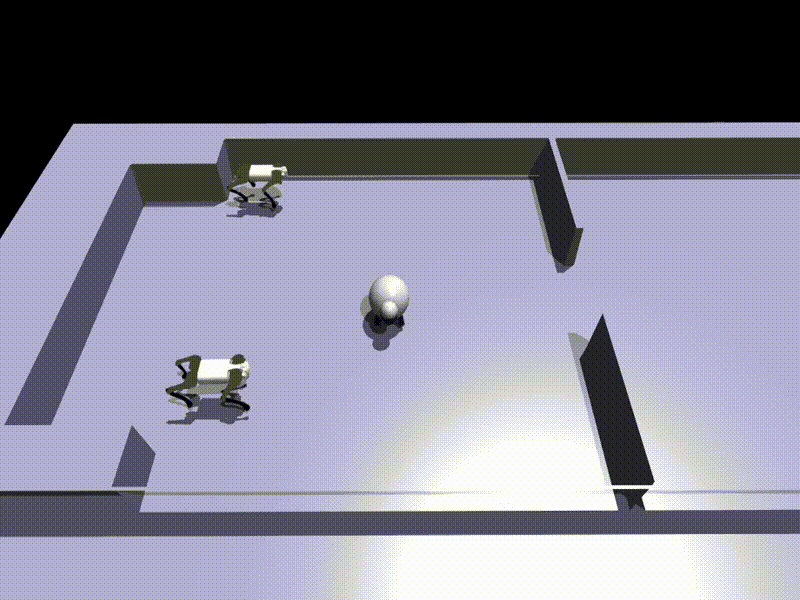
</p>

### 🌍 Sim2Real Deployment
SeqWM has also been successfully deployed on real Unitree Go2-W robots, confirming effective sim-to-real transfer.
<p align="center">
    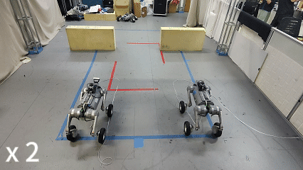
    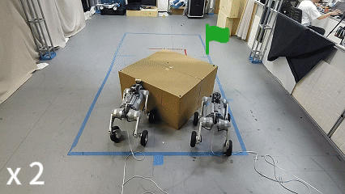
    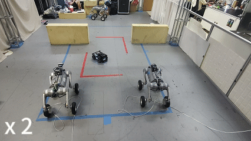
</p>

## 🧩 Advanced Cooperative Behaviors
As shown below, the robots exhibit predictive yielding and temporal alignment: some agents slow down in front of the gate (observable as troughs in their x-axis velocity commands), while others accelerate and pass through first (peaks in velocity commands). 
This wave-like pattern across agents reflects turn-taking and priority management, enabling smooth passage without collisions even in highly constrained environments.
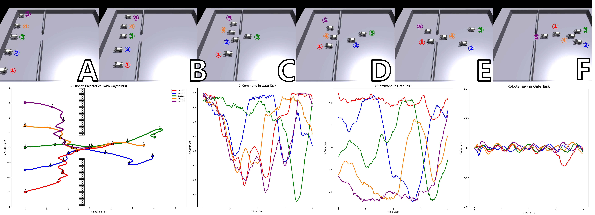


## 🙏 Acknowledgement & 📜 Citation
Our code is built upon [HARL](https://github.com/PKU-MARL/HARL), [TDMPC2](https://github.com/nicklashansen/tdmpc2) and [M3W](https://github.com/zhaozijie2022/m3w-marl). We thank all these authors for their nicely open sourced code and their great contributions to the community.

If you find our research helpful and would like to reference it in your work, please consider the following citations:

```bibtex
@inproceedings{zhao2025seqwm,
  title     = {Empowering Multi-Robot Cooperation via Sequential World Models},
  author    = {Zhao, Zijie and Guo, Honglei and Chen, Shengqian and Xu, Kaixuan and Jiang, Bo and Zhu, Yuanheng and Zhao, Dongbin},
  booktitle = {arXiv preprint},
  year      = {2025}
}
```